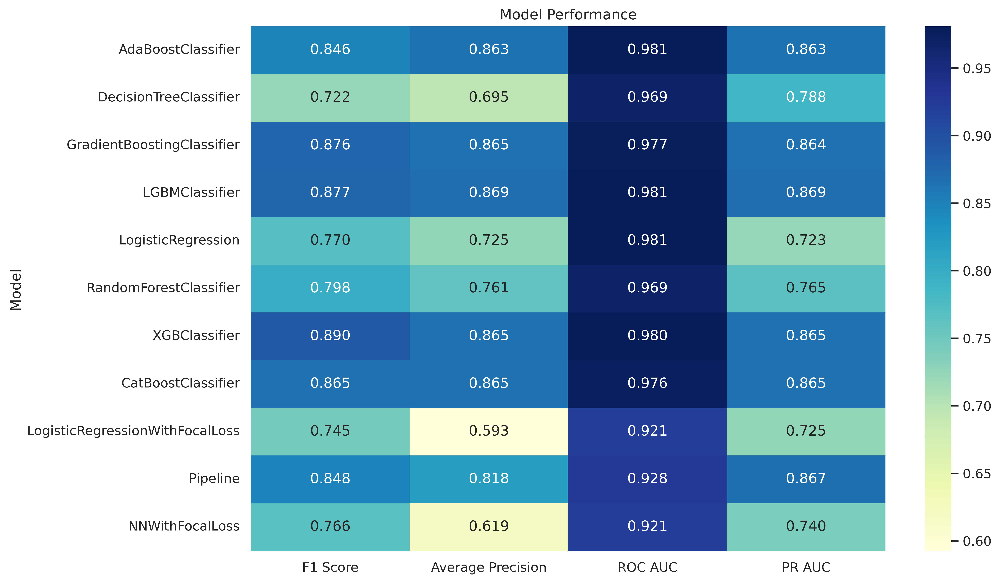

 
---

# Credit Card Fraud Detection

This project focuses on the challenging task of detecting fraudulent credit card transactions using a variety of machine learning models. The primary goal is to compare different modeling approaches for handling severely imbalanced data, with a specific emphasis on algorithmic solutions like custom loss functions over data-level solutions like resampling.

The dataset used is the highly popular [Credit Card Fraud Detection Dataset from Kaggle](https://www.kaggle.com/datasets/mlg-ulb/creditcardfraud), which contains transactions made by European cardholders.

A key characteristic of this dataset is its severe class imbalance: **less than 0.2% of all transactions are fraudulent**, making standard classification algorithms and metrics ineffective.

## Important Considerations

-   The project's main focus is on the **modeling phase**. Feature engineering and extensive exploratory data analysis (EDA) were intentionally kept minimal to concentrate on model performance.
-   The data used for training and evaluation is sourced from the `data/raw/split/` directory, which was pre-split as part of a course requirement.
-   The repository includes implementations of custom PyTorch classes (like Focal Loss) that are integral to the project's experiments.

## Data Fields

The dataset contains 31 features. The majority are anonymized PCA components, along with `Time` and `Amount`.

-   `Time`: Number of seconds elapsed between a given transaction and the first transaction in the dataset.
-   `V1` - `V28`: Anonymized features, which are the result of a PCA transformation. Due to confidentiality, the original feature names are not provided.
-   `Amount`: The transaction amount.
-   `Class`: The target variable, where `1` indicates a fraudulent transaction and `0` indicates a legitimate one.

## Project Structure

The repository is organized to separate data, source code, experiments, and results, promoting a reproducible and clean workflow.

```
.
├── data/
│   ├── raw/
│   │   ├── kaggle/creditcard.csv   # Original full dataset
│   │   └── split/                  # Pre-split data (train.csv, test.csv, etc.)
│   └── processed/                  # (Placeholder for any processed data)
│
├── experiments/                    # Contains all saved model experiments (.joblib & .json)
│   ├── XGboost_20250619_213836.joblib
│   └── ...
│
├── models/                         # Training scripts for each model family
│   ├── Boosting/
│   │   ├── ADAboost.py
│   │   └── ...
│   ├── Knn/
│   │   └── knn.py
│   ├── LogisticRegression/
│   │   ├── base.py
│   │   └── focalloss.py
│   ├── NN/
│   │   └── base.py
│   ├── Trees/
│   │   ├── decisiontree.py
│   │   └── randomforest.py
│   └── Voting/
│       └── voting.py
│
├── notebooks/
│   └── EDA.ipynb                   # Exploratory Data Analysis
│
├── reports/
│   ├── figures/                    # Saved plots and visualizations from experiments
│   └── Report/                     # Contains the final PDF summary report
│
├── src/
│   ├── custom_classes.py           # Custom class definitions (e.g., FocalLoss)
│   ├── path_config.py              # Manages all project paths
│   └── utils.py                    # Helper functions (loading, saving, plotting)
│
├── main.py                         # Main script to run experiments
├── requirements.txt                # Project dependencies
└── .gitignore                      # Specifies files for Git to ignore
```

## Installation and Usage

### 1. Dependencies

All standard Python dependencies required for this project are listed in the `requirements.txt` file. You can install them using pip:
```bash
pip install -r requirements.txt
```

### 2. How to Run

The main script `main.py` is used to run experiments. You can configure it to train and evaluate the models defined in the `models/` directory.

For example, to run the Logistic Regression training script directly:
```bash
python -m models.LogisticRegression.base
```
Similarly, to run the training for the model with Focal Loss:
```bash
python -m models.LogisticRegression.focalloss
```

### 3. Data Exploration

A Jupyter notebook containing a light exploratory data analysis can be found at `notebooks/EDA.ipynb`. Its primary purpose is to visualize the severe class imbalance and provide a basic overview of the data distributions.

## Modeling Approach

This project explored a wide array of classification algorithms to tackle the class imbalance problem:

-   **Standard Logistic Regression**
-   **Logistic Regression with Focal Loss:** An algorithmic approach to focus training on hard-to-classify examples (i.e., the minority fraud class).
-   **Tree-Based Models:** A comprehensive suite including Decision Tree, Random Forest, AdaBoost, Gradient Boosting, XGBoost, LightGBM, and CatBoost.
-   **K-Nearest Neighbors (KNN)**
-   **Neural Network with Focal Loss:** A PyTorch-based MLP designed to use Focal Loss.
-   **Ensemble Methods:** A hard-voting classifier combining the predictions of several of the best-performing models.

It was observed that boosting algorithms generally yielded the best performance in identifying fraudulent transactions.

## Results

The performance of each model was evaluated on a variety of metrics suitable for imbalanced classification, including F1-score, Average Precision (AP), and ROC AUC. XGBoost emerged as the top-performing model.

### Performance Metrics
| Model          | F1   | AP   | ROC  | PR   |
|----------------|------|------|------|------|
| AdaBoost       | 0.85 | 0.86 | 0.98 | 0.86 |
| DecisionTree   | 0.72 | 0.70 | 0.97 | 0.79 |
| GradBoost      | 0.88 | 0.86 | 0.98 | 0.86 |
| LGBM           | 0.88 | 0.87 | 0.98 | 0.87 |
| LogReg         | 0.77 | 0.72 | 0.98 | 0.72 |
| RF             | 0.80 | 0.76 | 0.97 | 0.77 |
| **XGB**        | **0.89** | **0.87** | **0.98** | **0.87** |
| CatBoost       | 0.87 | 0.87 | 0.98 | 0.87 |
| LogRegFocal    | 0.75 | 0.59 | 0.92 | 0.72 |
| KNN            | 0.85 | 0.82 | 0.93 | 0.87 |
| NNFocal        | 0.77 | 0.62 | 0.92 | 0.74 |

### Model Comparison Heatmap
This heatmap provides a visual comparison of all models across the key evaluation metrics.




## Future Enhancements

While this project achieved its primary goal of comparing modeling techniques, several avenues could be explored for further improvement:

-   **Data Resampling Techniques:** Experiment with oversampling the minority class (`SMOTE`) or undersampling the majority class to see how data-level approaches compare to the algorithmic methods used here.
-   **Feature Engineering:** Although intentionally out of scope, creating new features from `Time` and `Amount` could potentially improve performance.
-   **Hyperparameter Tuning:** Conduct a more exhaustive hyperparameter search for the top models using tools like Optuna or Hyperopt.
-   **Soft Voting Ensemble:** Implement a soft-voting classifier, which often outperforms hard voting by averaging the predicted probabilities.

## Resources

For understanding the challenges and techniques for imbalanced learning, the following resources are highly recommended:
-   [Learning from Imbalanced Classes | PyData](https://www.youtube.com/watch?v=u72FD79tsxA&ab_channel=PyData)
-   [Focal Loss for Dense Object Detection (Paper)](https://paperswithcode.com/method/focal-loss)
-   [A Walk-through of Imbalanced Data](https://fraud-detection-handbook.github.io/fraud-detection-handbook/Chapter_6_ImbalancedLearning/Ensembling.html)
-   [SMOTE Documentation](https://imbalanced-learn.org/stable/references/generated/imblearn.over_sampling.SMOTE.html#imblearn.over_sampling.SMOTE)
